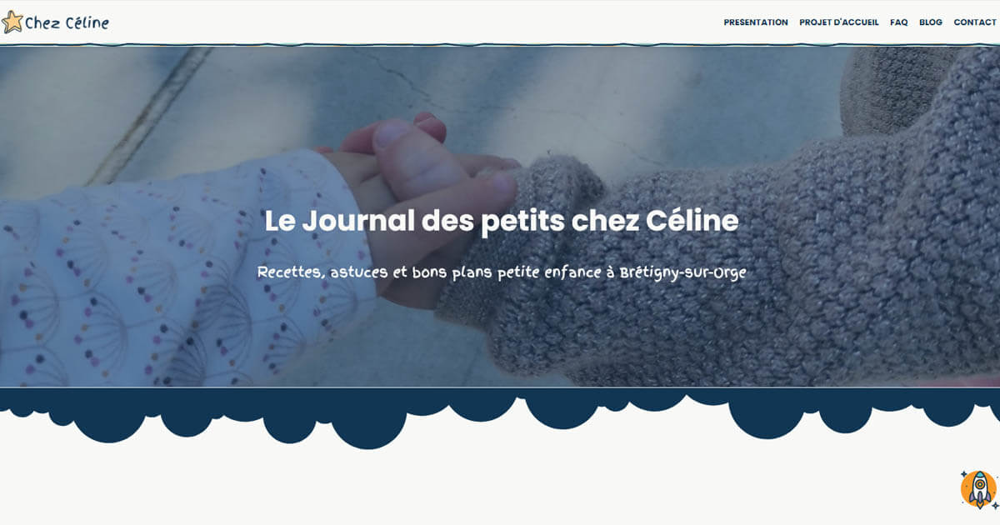

# Site Web de Céline Hubert - Assistante Maternelle Agréée




Bienvenue sur le site de Céline Hubert, assistante maternelle agréée, dédié à la présentation de mes services de garde d’enfants. Ce projet web a été conçu avec des outils modernes pour offrir une expérience rapide, intuitive et personnalisée, tout en intégrant un blog pour partager des articles utiles aux parents.

👉 **[Découvrez le site en ligne](https://chubert91assmat.netlify.app)**  

## Sommaire

1. [Aperçu du projet](#aperçu-du-projet)
2. [Pages principales](#pages-principales)
3. [Atouts du projet](#atouts-du-projet)
4. [Technologies et outils](#technologies-et-outils)
5. [Installation et configuration](#installation-et-configuration)
6. [Structure du projet](#structure-du-projet)
7. [Choix des technologies](#choix-des-technologies)
8. [Contact](#contact)
9. [Remerciements](#remerciements)


## Aperçu du projet

Ce site a été conçu pour présenter les services de garde d'enfants de Céline Hubert, assistante maternelle agréée, et pour fournir aux parents des informations pratiques à travers un blog dynamique.  

### Objectifs principaux :
- **Informer les parents** sur mon projet d’accueil, mes valeurs éducatives et les activités proposées.
- **Simplifier les démarches** avec un formulaire de contact accessible et clair.
- **Partager des articles utiles** sur des sujets variés liés à la garde d’enfants.

Le site a été créé avec **Eleventy** et **Netlify CMS**, combinant performance, flexibilité et sécurité pour offrir une expérience optimale à mes visiteurs.


## Pages principales

- **Page d'accueil** : Introduction à mes services, mon parcours professionnel et les avantages de mon mode d'accueil.  
- **Page Projet d'Accueil** : Détail de mon projet éducatif, des activités proposées et des modalités d'adaptation.  
- **Page Contact** : Formulaire pour me contacter et me localiser.  
- **Blog** : Articles utiles pour les parents, organisés par catégories (activités, soins, recettes, etc.).  
- **Mentions légales** : Informations sur la propriété intellectuelle, les cookies et la protection des données.  


## Technologies et outils

### Langages de programmation :
- **HTML5**, **CSS3**, **JavaScript**

### Frameworks et outils :
- **Bootstrap 5** : Design moderne et responsive.
- **Eleventy** : Générateur de sites statiques rapide et flexible.
- **Netlify CMS** : Gestion intuitive du contenu via une interface web.
- **Nunjucks / Liquid** : Moteurs de templates pour les pages dynamiques.


## Installation et configuration

Pour exécuter ce projet localement, suivez ces étapes :

### Prérequis
Assurez-vous d'avoir installé :
- **Node.js** 
- **npm** (installé avec Node.js)

### Étapes d'installation
1. Clonez ce dépôt :  
```bash
  git clone https://github.com/Celinahub/assmatprojet.git
cd nom-du-projet
```

2. Installez les dépendances : 
```bash
  npm install
```

3. Lancez un serveur local :
 ```bash
  npx eleventy --serve
```

4. Générez les fichiers de production : 
```bash
  npx eleventy
```
  Les fichiers générés se trouvent dans le dossier _site.

## Structure du projet

```bash
assmatprojet/
|-- _data/ 
|    |-- metadata.json           # Fichier de métadonnées pour configurer ou enrichir le contenu.
|
|-- _includes/
|    |-- layouts/                # Modèles (templates) pour les différentes pages du site.
|       |-- base.njk             # Modèle de base (layout principal) pour le site.
|       |-- pagination.njk       # Gère l'affichage des pages paginées.
|       |-- post.njk             # Template d'affichage pour un article unique.
|       |-- postslist.njk        # (Non utilisé actuellement) Affichage centralisé des articles.
|       |-- widget/              # Widgets partagés pour l'ensemble du site.
|           |-- barre-laterale-blog.njk # Barre latérale personnalisée pour le blog.
|           |-- footer.njk       # Pied de page.
|           |-- head.njk         # Métadonnées et liens dans la balise <head>.
|           |-- header.njk       # En-tête global.
|           |-- nav.njk          # Barre de navigation principale.
|           |-- newsletter.njk   # Widget pour l'inscription à la newsletter.
|           |-- partage-article-reseaux.njk # Liens de partage sur les réseaux sociaux.
|           |-- rss-link.njk     # Lien vers le flux RSS.
|
|-- admin/                       # Fichiers de configuration pour Netlify CMS.
|    |-- config.yml              # Configuration principale du CMS.
|    |-- index.html              # Interface du CMS pour la gestion du contenu.
|
|-- categories/                  # Pages spécifiques pour les différentes catégories d'articles.
|    |-- activites-enfant.njk    # Catégorie : Activités pour enfants.
|    |-- actualites-locales.njk  # Catégorie : Actualités locales.
|    |-- collectivite-rpe.njk    # Catégorie : Informations sur les RPE et collectivités.
|    |-- entreprises.njk         # Catégorie : Services ou partenaires d’entreprises.
|    |-- hygiene-soins.njk       # Catégorie : Hygiène et soins.
|    |-- recettes-atelier-cuisine.njk # Catégorie : Recettes et ateliers cuisine.
|    |-- selection-produits.njk  # Catégorie : Sélections de produits.
|
|-- css/
|    |-- style.css               # Feuille de styles principale du site.
|
|-- feed/
|    |-- feed.njk                # Modèle pour générer un flux RSS moderne (Atom).
|
|-- images/                      # Dossier contenant toutes les ressources graphiques et images.
|
|-- netlify/                     # Fonctions Serverless pour Netlify.
|    |-- functions/
|        |-- list-posts.js       # Fonction listant les publications des fichiers Markdown dans le CMS.
|        |-- posts.js            # Génère une version HTML des articles avec leurs métadonnées.
|
|-- posts/                       # Dossier contenant les articles de blog au format Markdown.
|    |-- dossiers-categories/    # Sous-dossier pour organiser les articles par catégorie.
|        |-- articles.md         # Exemple d'article.
|
|-- .eleventy.js                 # Configuration principale pour Eleventy.
|-- _redirects                   # Fichier pour configurer les redirections sur Netlify.
|-- 404.md                       # Page personnalisée pour les erreurs 404.
|-- blog.njk                     # Page principale pour le blog.
|-- contact.njk                  # Page de contact.
|-- faq.njk                      # Page FAQ (Foire Aux Questions).
|-- favicon.ico                  # Icône du site.
|-- index.njk                    # Page d'accueil.
|-- mentions-legales.njk         # Page des mentions légales.
|-- netlify.toml                 # Fichier de configuration Netlify.
|-- posts.njk                    # Liste des articles de blog.
|-- projet-accueil.njk           # Page détaillant le projet éducatif.
|-- README.md                    # Documentation pour les développeurs.
|-- robots.txt.njk               # Configuration pour les robots d'exploration (SEO).
|-- rss.xml.njk                  # Flux RSS standard.
|-- rss.info.njk                 # Page supplémentaire d'information sur le RSS.
|-- sitemap.xml.njk              # Plan du site pour les moteurs de recherche.
```

## Choix des technologies

**1. Eleventy (Générateur de sites statiques)**
- **Performance et rapidité :** Génère des fichiers HTML statiques, ce qui permet des temps de chargement très rapides et une expérience utilisateur fluide.
- **Flexibilité :** Supporte plusieurs langages et offre un contrôle total sur la structure et le design du site.
- **Sécurité :** Aucun besoin de base de données ou de scripts côté serveur, réduisant ainsi les risques de failles de sécurité.

**2. Netlify CMS (Gestion de contenu headless)**
- **Simplicité :** Fournit une interface web intuitive pour gérer le contenu.
- **Workflows sécurisés :** Utilise Git pour versionner les modifications, permettant un suivi et une restauration faciles.
- **Compatibilité :** Conçu pour fonctionner de manière optimale avec les sites statiques, sans compromettre les performances.

Ces choix technologiques garantissent un site performant, évolutif et sécurisé, tout en offrant une grande liberté de création et une maintenance simplifiée.


## Contact
Pour toute question ou demande d'informations supplémentaires, veuillez me contacter via le formulaire disponible sur la [page de contact](https://chubert91assmat.netlify.app/contact/).

## 🙏 Remerciements

Je tiens à remercier :
- **La communauté Open Source**, pour les outils et ressources qui ont permis la création de ce site.
- **Les parents** qui me font confiance chaque jour dans mon rôle d'assistante maternelle.
- **Les créateurs de tutoriels YouTube**, pour leur partage de connaissances.

Ce projet est une combinaison de passion pour mon métier et d’apprentissage constant dans le domaine du développement web. Merci pour votre visite !


---

© 2024 Céline Hubert - Assistante Maternelle agréée.
